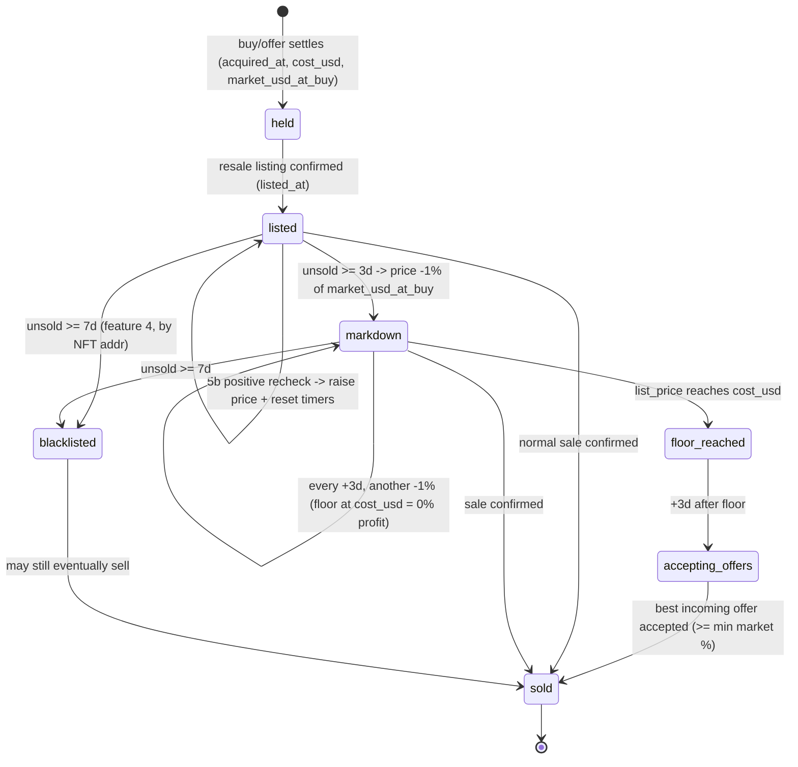

# Holdings Lifecycle & Offer-Penetration — Workflow Plan

> **Status:** Planning only. No code is written yet. This document is the agreed
> workflow before implementation. It extends the autonomous trader with five
> new behaviours that all revolve around what happens *after* a buy/offer is
> placed and *while* a card is owned.

## 0. Guiding principles (carried over from the project)

- **No assumptions are ever coded — every function must be verified and covered
  by a pytest test.** This is a hard rule, not a preference:
  - **No live API shape is assumed.** Any request body, endpoint, or response
    shape that touches the real CC/Privy API must be **captured from DevTools and
    verified live** before it is wired into the live path. Until verified, the
    call lives behind the adapter seam and the live branch returns a safe failure
    (no money moved) — it is never shipped as a guess.
  - **Every new function ships with a pytest test.** No behaviour (pure logic,
    store method, executor path, engine pass, risk guard, config field) is
    considered done until it has at least one passing test. Pure decision logic
    is tested with injected/frozen timestamps; store methods with a `tmp_path` DB;
    executor/engine paths with the existing fakes. A change that cannot be tested
    is a change that is not ready to merge.
  - **Verified vs. assumed is tracked explicitly.** Each seam method is marked
    `ASSUMED` in `docs/api.md` until a captured request flips it to `VERIFIED`,
    mirroring the existing SIWS / `marketplace/buy` entries.
- **No guessing against the live API.** Every new behaviour that needs a CC
  endpoint we have not yet verified is built behind a thin **adapter seam** and
  ships **dry-run + fully tested first**. The live wiring is filled in only once
  the real request is captured via DevTools (same approach that fixed SIWS and
  `marketplace/buy`).
- **Failure default = no trade / no destructive action.** Unreadable state never
  lowers a price, cancels an offer, or accepts a bid.
- **Small, reviewable, shippable steps.** Each phase keeps the full pytest suite
  green (currently 619) and leaves `TRADER_LIVE` safe to stay off.
- **All money-moving calls stay non-retryable** (no double-spend), like the
  existing `initiate_buy` / `make_offer` / `broadcast`.

---

## 1. The five features (confirmed scope)

| # | Feature | One-line behaviour |
|---|---------|--------------------|
| 1 | **Offer penetration** | An offer older than 1 day is *bumped* by +0.10 USDC to re-trigger the owner's notification. Repeat up to 3×; if still no reaction, **cancel** the offer (escrow refunds). |
| 2 | **Min operating volume** | Below a configurable available-USDC threshold the bot stops *new* buys/offers; it resumes sourcing once volume is back above it. |
| 3 | **Max owned cards** | A configurable cap on **actually held** cards (a buy/offer that successfully settled and is not yet sold). Prevents over-allocation into inventory. |
| 4 | **Unpopular blacklist** | A held card that does not sell within 1 week is flagged "unpopular" by its Solana NFT address and is **never bought/offered again** (acts as a permanent, UI-clearable blacklist). |
| 5 | **Damage control (markdown + offer accept)** | A held card unsold after 3 days is marked down by 1% of its **market value at purchase** every 3 days, down to a 0%-profit floor (cost basis). After the floor, after a further 3 days, the **best incoming offer** is accepted if the market value is not below a configurable %. |

### 5b. Market-value re-check refinement (confirmed, point k)

- The **market value at the moment of buy / triggered offer is persisted** as the
  cost-basis reference (this is also what the markdown curve in feature 5 is
  measured against).
- While a card is held, its **current** market value can be re-checked periodically:
  - **Positive change** (market value rose) → **raise** the resell price to the new
    market-based target and **restart the sell cycle at day 0** (reset the markdown
    clock / the 3-day timers).
  - **Negative change** (market value fell) → **no reset**; the normal sell cycle
    (markdown timers already running) simply continues unchanged.

---

## 2. Live-API verification dependencies (the real blocker)

Most of these features need CC operations we have **not** verified live yet. The
plan therefore separates **decision logic (buildable now)** from **live execution
(needs a captured request)**.

| Capability needed | By feature | Current status | How we close it |
|-------------------|-----------|----------------|-----------------|
| Edit/raise an existing offer | 1 | ✅ **VERIFIED** (E8.1) — `marketplace/update-offer` `{buyer,currency,nftAddress,price,wallet}` is a real offer edit; make-offer body fixed (`cardId` was the missing field) | Done (DevTools capture 2026-06-07) |
| Cancel an offer | 1 | ✅ **VERIFIED** (E8.1) — `marketplace/cancel-offer` `{coin,keepInEscrow,nftAddress,wallet}` (no offer id) | Done (DevTools capture 2026-06-07) |
| Detect "sold / not sold" for a held card | 4, 5 | ✅ **VERIFIED** (E8.2) — absence from the fully-paged owned-cards set (`cards/{wallet}/`) is the authoritative sold signal | Done (DevTools capture 2026-06-07) |
| Change a live listing price (markdown) | 5 | ✅ **VERIFIED** (E8.3) — `marketplace/update-listing` `{coin,newPrice,seller,tokenMint,wallet}`; bare base64 tx | Done (DevTools capture 2026-06-07) |
| Read incoming offers for a held card | 5 | ✅ **VERIFIED** (E8.3) — `GET card-activity/{nft}?day=60&v2=true` feed; best bid via `best_active_offer` | Done (DevTools capture 2026-06-07) |
| Accept an offer | 5 | ✅ **VERIFIED** (E8.3) — `marketplace/accept-offer` `{buyer,currency,nftAddress,price,wallet}` (no offer id); bare base64 tx | Done (DevTools capture 2026-06-07) |
| Current market value of a held card | 5b | ✅ **VERIFIED** (E8.4) — per-card `oraclePrice` in the `cards/{wallet}/` owned-cards response | Done (DevTools capture 2026-06-07) |

> **Implication:** Phases 1–3 below are pure logic + persistence + dry-run and can
> land immediately. Phases 4–5 (live wiring) wait on the DevTools captures, exactly
> like the make-offer/broadcast work already queued in the live-readiness plan.

---

## 3. Data model changes

### 3.1 New `holdings` table (the missing source of truth)

None of features 3/4/5/5b are possible without a durable per-card inventory record.
Add to `trader/store.py` (mirrors the existing `orders`/`cycles`/`runtime` tables,
no secrets, `*.db` already gitignored):

```
holdings (
    nft               TEXT PRIMARY KEY,
    name              TEXT,
    category          TEXT,
    acquired_at       REAL,        -- when the buy/offer settled (ownership start)
    cost_usd          REAL,        -- what we actually paid (cost basis / 0%-profit floor)
    market_usd_at_buy REAL,        -- market value snapshot at acquisition (feature 5 + 5b ref)
    market_usd_current REAL,       -- last re-checked market value (5b)
    market_checked_at REAL,        -- when 5b last re-checked
    listed_at         REAL,        -- when the resale listing went live (sell-cycle start)
    list_price_usd    REAL,        -- current live resale price
    last_markdown_at  REAL,        -- last time the markdown step ran
    markdown_steps    INTEGER,     -- how many 1% steps applied
    sold_at           REAL,        -- set when sale confirmed (NULL = still held)
    blacklisted       INTEGER,     -- 1 = unpopular, never buy again (feature 4)
    blacklisted_at    REAL,
    status            TEXT         -- e.g. held / listed / floor_reached / accepting_offers / sold
)
```

New store methods (each its own short-lived connection, write-locked, like the rest):
`upsert_holding`, `get_holding`, `held_cards()`, `owned_count()` (feature 3),
`is_blacklisted(nft)` / `blacklisted_nfts()` (feature 4), `mark_blacklisted(nft)`,
`clear_blacklist(nft)` (UI button), `holdings_due_for_markdown(now)`,
`holdings_due_for_offer_accept(now)`.

### 3.2 Holding lifecycle (state machine)



> Note: "blacklisted" (never **buy** again) and the sell-side markdown run in
> parallel — flagging a held card as unpopular does not stop us trying to sell the
> one we already own; it only prevents re-acquiring that NFT.

---

## 4. New settings (UI-editable, defaults match the spec)

Add to `trader/settings.py` `EDITABLE_FIELDS` and `trader/config.py` (layered `src`,
so UI-editable; same pattern as existing knobs). All default to the spec values; the
**timers/percentages are configurable** as agreed (a–k all "recommendation = yes").

| Env / field | Label | Default | Group | Feature |
|-------------|-------|---------|-------|---------|
| `TRADER_OFFER_BUMP_USD` | Offer bump amount (USDC) | `0.10` | Offer penetration | 1 |
| `TRADER_OFFER_BUMP_AGE_HOURS` | Offer age before bump (h) | `24` | Offer penetration | 1 |
| `TRADER_OFFER_BUMP_MAX` | Max offer bumps | `3` | Offer penetration | 1 |
| `TRADER_MIN_OPERATE_USD` | Min operating volume (USDC) | `0` (disabled) | Budget | 2 |
| `TRADER_MAX_OWNED_CARDS` | Max owned cards | `0` (disabled) | Risk limits | 3 |
| `TRADER_UNPOPULAR_DAYS` | Days unsold → blacklist | `7` | Inventory | 4 |
| `TRADER_MARKDOWN_DELAY_DAYS` | Days unsold → start markdown | `3` | Inventory | 5 |
| `TRADER_MARKDOWN_STEP_PCT` | Markdown step % of buy market value | `1` | Inventory | 5 |
| `TRADER_MARKDOWN_INTERVAL_DAYS` | Days between markdown steps | `3` | Inventory | 5 |
| `TRADER_OFFER_ACCEPT_DELAY_DAYS` | Days after floor → accept offers | `3` | Inventory | 5 |
| `TRADER_OFFER_ACCEPT_MIN_MARKET_PCT` | Min market % to accept a bid | `0` (disabled) | Inventory | 5 |
| `TRADER_MARKET_RECHECK_HOURS` | Held-card market re-check interval (h) | `24` | Inventory | 5b |

- `0 = disabled` for the new caps/thresholds keeps existing setups unchanged until
  the operator opts in (same convention as the risk limits).
- Security-sensitive switches stay env-only; these are all strategy tuning, so they
  live in `trader_settings.json` like the rest.

---

## 5. Feature-by-feature design

### Feature 1 — Offer penetration (bump then cancel)

- **Where:** new maintenance pass in `engine.run_cycle` live branch (alongside
  `_run_status_sync` / `_run_exit_flow`), plus pure helpers in a new
  `trader/holdings.py` (decision logic, side-effect-free, unit-testable).
- **Logic per open offer (`store.open_offers()` + per-offer timing on the order):**
  1. If `now - last_bump_at >= TRADER_OFFER_BUMP_AGE_HOURS` and `bump_count < max`:
     raise bid by `TRADER_OFFER_BUMP_USD`, increment `bump_count`, set `last_bump_at`.
     Re-check it still respects the per-card cap / available volume before sending.
  2. If `bump_count >= TRADER_OFFER_BUMP_MAX` and aged again with no fill →
     **cancel** the offer (escrow refunds).
- **Order model:** add `bump_count` + `last_bump_at` (store columns on `orders`, or
  fold into the offer's history). Reuse existing `OrderStatus.OPEN` → `CANCELLED`.
- **Live seam:** `CCTradingClient` gains `edit_offer` (or cancel+re-make fallback)
  and verified `cancel_offer`. Until captured: dry-run executor simulates the bump
  (updates price + count) and the cancel, fully tested; live path raises
  `NotImplemented`-style safe failure → order left untouched (no money moved).
- **Reversibility:** cancel is the refund path, so this is the safest live feature to
  verify first (matches the existing "reversible offer test" in the readiness plan).

### Feature 2 — Min operating volume gate

- **Where:** `engine.run_cycle`, right where `available_volume` is computed.
- **Logic:** if `available_volume < TRADER_MIN_OPERATE_USD` (and the limit is > 0):
  skip the **buy + offer** stages entirely for this cycle (build an empty plan,
  report a clear reason like `"paused: volume $X < min $Y"`). Maintenance passes
  (status sync, markdown, offer bumps, exit/relist) **still run** — we keep managing
  inventory we already own, we just stop *acquiring*.
- **No live dependency** — pure gate on existing balance reads. Can land in Phase 1.

### Feature 3 — Max owned cards cap

- **Where:** an additional guard in the **risk layer** (`trader/risk.py`) and/or the
  plan builder, fed by `store.owned_count()`.
- **Logic:** if `owned_count() + planned_new_acquisitions > TRADER_MAX_OWNED_CARDS`
  (limit > 0): block the surplus **new** buys/offers (cheapest-first keeps the most
  cards per dollar, consistent with existing allocation). Running offers, markdowns
  and sells are unaffected.
- **"Owned" definition:** rows in `holdings` with `sold_at IS NULL` (settled buys +
  filled offers, minus confirmed sales). Open (unfilled) offers are *pending*, not
  owned — counted separately so we don't double-block.
- **Mostly logic** — depends on the holdings table being populated (Phase 1) and on
  knowing when a sale completes (needs the "sold" signal → live-dependent for the
  decrement, but the cap itself works from acquisitions immediately).

### Feature 4 — Unpopular blacklist

- **Where:** inventory maintenance pass; pure check in `trader/holdings.py`.
- **Logic:** for each held, listed-but-unsold card where
  `now - listed_at >= TRADER_UNPOPULAR_DAYS`: set `blacklisted=1` (+ timestamp).
  In sourcing (`strategy.make_candidates` / `make_offer_candidates` or an engine
  pre-filter), drop any NFT in `store.blacklisted_nfts()` — blocks **both** buys and
  offers (per decision h).
- **Persistence:** permanent, but **UI-clearable** (per decision g) via a new
  `clear_blacklist(nft)` route + a list in the trader dashboard.
- **Live dependency:** detecting "unsold after N days" needs the sold/not-sold signal
  (same capture as feature 5). The blacklist *enforcement* (don't buy) is pure and
  testable now; the *flagging* trigger waits on the status source.

### Feature 5 — Damage control (markdown → offer accept)

- **Where:** inventory maintenance pass; markdown math is a pure helper.
- **Markdown curve (measured against `market_usd_at_buy`, per spec):**
  - Start when `now - listed_at >= TRADER_MARKDOWN_DELAY_DAYS` (default 3).
  - Each `TRADER_MARKDOWN_INTERVAL_DAYS` (default 3): new price =
    `max(cost_usd, list_price - market_usd_at_buy * TRADER_MARKDOWN_STEP_PCT/100)`.
  - **Floor = `cost_usd`** (0% profit, decision i). Never below cost.
- **Offer-accept stage (after floor):**
  - Once at floor for `TRADER_OFFER_ACCEPT_DELAY_DAYS` more (default 3): read the
    card-activity feed (`get_card_activity`), reconstruct the best still-open bid
    (`best_active_offer`), and accept it **iff** the offer's implied value is
    **not below** `TRADER_OFFER_ACCEPT_MIN_MARKET_PCT` of the relevant market value
    (decision k uses the persisted/last-checked market value).
- **Live seam (E8.3, all VERIFIED & LIVE):** `CCTradingClient` methods —
  `update_listing` (`marketplace/update-listing`), `get_card_activity`
  (`GET card-activity/{nft}`), `accept_offer` (`marketplace/accept-offer`). The
  `LiveExecutor` markdown/accept paths sign + broadcast and fail safe; dry-run
  simulates and is fully tested.

### Feature 5b — Market-value re-check (confirmed refinement)

- **Where:** inventory maintenance pass, throttled by `TRADER_MARKET_RECHECK_HOURS`.
- **Logic per held, unsold card:**
  1. Fetch current market value (source TBD — see §2 open item), store
     `market_usd_current` + `market_checked_at`.
  2. If `market_usd_current > market_usd_at_buy` (**positive**): raise the resale
     target to the new market-based price, reset `listed_at` / `last_markdown_at` /
     `markdown_steps` (sell cycle **restarts at day 0**), **and overwrite the stored
     `market_usd_at_buy` with `market_usd_current`** (see critical note below).
  3. If `market_usd_current <= market_usd_at_buy` (**negative/flat**): leave timers
     untouched — the normal markdown cycle continues.
- **⚠️ Critical — overwrite the reference, do not just compare:** on a positive
  change the **new market value must replace the stored `market_usd_at_buy`**.
  Otherwise every subsequent re-check would still read the *old* (lower) reference,
  see "positive" again, and reset the sell cycle to day 0 **on every cycle forever**
  — the card would be held indefinitely and never sell. By overwriting, the next
  re-check compares against the already-raised value, so a reset only happens again
  if the market rises *further*. (The markdown floor still uses `cost_usd`, so the
  raised reference never lets the price fall below what we paid.)
  - Implication for the markdown floor: after a positive recheck the markdown is
    measured against the **new** `market_usd_at_buy`, but the 0%-profit floor stays
    pinned to the original `cost_usd` — the two are intentionally separate columns.
- **Open decision (needs your input later):** the *source* of the current market value
  for a single owned NFT — re-query its insured value via a card-detail lookup, or
  reuse the marketplace scan if the card is relisted. This is the one place we must
  not assume; we capture/confirm before wiring.

---

## 6. Module touch map

| Module | Change |
|--------|--------|
| `trader/store.py` | New `holdings` table + methods; offer `bump_count`/`last_bump_at` persistence |
| `trader/config.py` | 12 new config fields (defaults per §4) |
| `trader/settings.py` | Matching `EDITABLE_FIELDS` (UI form) |
| `trader/holdings.py` *(new)* | Pure decision logic: markdown curve, aging, blacklist test, bump test, 5b recheck — all side-effect-free + unit-tested |
| `trader/ccapi.py` | Seam methods (all VERIFIED): `update_offer`/`cancel_offer`, `update_listing`, `get_card_activity`, `accept_offer` — non-retryable writes + idempotent feed read |
| `trader/executor.py` | Dry-run + live handlers for bump/cancel/markdown/accept; populate `holdings` on settled buy/offer and on confirmed sale |
| `trader/engine.py` | New maintenance passes in the live branch; min-operate gate; feed blacklist filter into sourcing |
| `trader/risk.py` | Max-owned-cards guard |
| `web.py` + `templates/trader.html` + `static/js/trader.js` | Holdings panel, blacklist list + clear button, offer bump counter, markdown status |
| `docs/api.md` | Document each new (assumed→verified) endpoint shape |
| `tests/` | New `test_holdings.py` + extend store/engine/executor/risk/config tests |

---

## 7. Enforcement plan — stages (Etappen)

The work is broken into **8 stages**. Each stage is small, independently
shippable, ends with **all pytest green** and `TRADER_LIVE` safe to stay off.
Stages 1–7 need **no** live-API verification; stage 8 is the only one that
touches real money and is gated on DevTools captures.

> **Execution protocol (how each stage is run):**
> 1. Exactly **one** stage is worked at a time.
> 2. When a stage is finished it ends with a **summary** of what was implemented
>    (files, functions, tests added, test count) **and** an explicit note on **how
>    the next stage builds on it** (the hand-off / integration point).
> 3. **Commit after every stage.** Once a stage is green (full pytest suite
>    passing), its changes are committed as a single, self-contained commit with a
>    message naming the stage (e.g. `holdings E3: pure decision logic`). The next
>    stage starts from a clean working tree, so each Etappe is independently
>    revertable.
> 4. Work continues to the next stage **only after a clear instruction to proceed**
>    (e.g. "weiter" / "mach die nächste Etappe"). No stage starts itself.
>
> **Definition of done for every stage (hard gate, from §0):** no function is
> merged without (a) a passing pytest test, and (b) — for anything touching the
> live API — a DevTools-captured, *verified* request shape. No assumed shape is
> wired into the live path while it is still a guess.

Stages are ordered so every later stage only depends on already-completed ones.

### Etappe 1 — Persistence foundation (holdings table + store methods)

- **Files:** `trader/store.py`, `tests/test_store.py`.
- **Work:**
  - Append a `holdings` table to the module-level `_SCHEMA` string (so
    `executescript` auto-migrates on startup — `CREATE TABLE IF NOT EXISTS` is
    idempotent, no migration runner needed). Columns per §3.1; `INTEGER DEFAULT 0`
    for booleans, `REAL` for timestamps, **no FK** to `orders.nft` (matches the
    existing no-FK convention even though `PRAGMA foreign_keys=ON`).
  - Add two indexes: `idx_holdings_status`, `idx_holdings_blacklisted`.
  - Add `bump_count INTEGER DEFAULT 0` + `last_bump_at REAL` columns to the
    `orders` table (offer penetration is query-driven, so columns — not
    `history_json`); add both to the `ON CONFLICT(...) DO UPDATE SET` list in
    `_upsert_order`, and to `_ORDER_COLUMNS` + `Order.to_dict/from_dict`.
  - Module-level `_row_to_holding(row)` decoder (mirrors `_row_to_order`).
  - Store methods (each its own short-lived connection; **writes** take
    `self._write_lock`, reads do not): `upsert_holding`, `get_holding`,
    `held_cards`, `holdings_list` (all rows, for the UI), `owned_count`,
    `confirmed_buy_count` (for the risk cap in Etappe 4), `is_blacklisted`,
    `blacklisted_nfts`, `mark_blacklisted`, `clear_blacklist`,
    `holdings_due_for_markdown(*, min_listed_age_sec, max_steps)`,
    `holdings_due_for_offer_accept(*, min_listed_age_sec)`. Use the
    `ON CONFLICT(nft) DO UPDATE SET` upsert shape; `id/acquired_at/cost_usd` style
    immutable-on-insert columns stay out of the update list.
- **Tests:** mirror `test_store.py` patterns — `store` fixture (`tmp_path` +
  `TRADER_STORE_PATH` monkeypatch), upsert+read-back, ON-CONFLICT update,
  `held_cards` excludes sold/blacklisted, blacklist round-trip, `due_for_*`
  cutoffs, durability across a new `OrderStore` instance.
- **Hand-off → Etappe 2:** the table + `*_due_*`/`owned_count`/`blacklisted_nfts`
  queries are the data substrate that the config thresholds (Etappe 2) parametrise
  and the pure logic (Etappe 3) consumes.

### Etappe 2 — Config + settings (the 12 new tunables)

- **Files:** `trader/config.py`, `trader/settings.py`, `tests/conftest.py`,
  `tests/test_config_settings.py`.
- **Work:**
  - Add the 12 fields from §4 to the `TraderConfig` frozen dataclass and to
    `load_config()` reading from **`src`** (layered = UI-editable), using
    `_get_float`/`_get_int` with the §4 defaults. None of these are security
    switches, so **none** are env-only.
  - **Critical:** add all 12 to `_CONFIG_DEFAULTS` in `conftest.py` or every
    existing `make_config()` call breaks with a `TypeError`.
  - Add 12 matching `EDITABLE_FIELDS` specs (groups `"Offers"` + `"Holdings"`;
    `type:"number"` with min/max/step). `_validate` enforces min/max automatically.
- **Tests:** `test_config_settings.py` patterns — JSON-overrides-win, default-when-
  unset, min enforced via `save_overrides`, each new key present in
  `settingsmod._EDITABLE_ENV`. Use `clean_env` + `settings_file` (dual-patch
  `OVERRIDES_PATH` **and** `TRADER_SETTINGS_PATH`).
- **Hand-off → Etappe 3:** these config values are the thresholds/percentages the
  pure decision functions take as inputs (e.g. markdown step %, bump age, recheck
  hours), keeping the logic itself side-effect-free.

### Etappe 3 — Pure decision logic (`trader/holdings.py`, new)

- **Files:** `trader/holdings.py` *(new)*, `tests/test_holdings.py` *(new)*.
- **Work:** side-effect-free helpers, every one taking an injected `now` (no real
  clock) and a `TraderConfig`:
  - `markdown_price(holding, cfg)` → next price, clamped to the `cost_usd` floor;
    uses `market_usd_at_buy` for the step size.
  - `is_due_for_markdown(holding, cfg, now)` / `is_due_for_offer_accept(...)`.
  - `should_blacklist(holding, cfg, now)` (listed + unsold ≥ `UNPOPULAR_DAYS`).
  - `should_bump(order, cfg, now)` and `next_bump_price(order, cfg)` (≤ max bumps,
    aged ≥ bump age) and `should_cancel_offer(order, cfg, now)` (bumps exhausted +
    aged again).
  - `recheck_decision(holding, current_market, cfg)` → encodes §5b: positive ⇒
    raise price + reset timers + **overwrite `market_usd_at_buy`**; non-positive ⇒
    no change. Returns a plain "what to change" struct (no I/O).
- **Tests:** frozen timestamps drive the markdown curve, the floor clamp (never
  below cost), aging thresholds, the bump-count ceiling, the blacklist trigger, and
  both §5b branches (incl. the no-infinite-reset property — a second recheck at the
  same market must **not** reset again).
- **Hand-off → Etappe 4 & 6:** Etappe 4 (acquisition gates) and Etappe 6
  (maintenance passes) call these pure functions and only add the I/O around them.

### Etappe 4 — Acquisition gates (no live dependency)

Implements Features 2, 3, 4-enforcement — all pure decisions on existing data.

- **Files:** `trader/engine.py`, `trader/risk.py`, `trader/strategy.py`,
  `trader/store.py` (already has `confirmed_buy_count` from Etappe 1),
  `tests/test_engine_live.py`, `tests/test_risk.py`.
- **Work:**
  - **Feature 2 — min-operate gate:** in `run_cycle`, right after
    `available_volume` is resolved and **before** `_collect_listings()`, on
    non-demo cycles: if `available_volume < cfg.min_operate_usd` (and limit > 0),
    skip planning/execution, return a `"paused: volume $X < min $Y"` report. (This
    is the earliest point the real balance is known.)
  - **Feature 3 — max-owned cap:** add `max_owned_cards` to `RiskEngine._limits()`,
    `owned_cards` to `_usage()` (via `store.confirmed_buy_count()`), a pre-loop
    `owned_count`, an `elif` BUY-only block in `evaluate()` (offers don't transfer
    ownership yet), and the `owned_count += 1` increment in the allow branch. Mirror
    the existing `max_open_positions` shape exactly; surface in `posture()`.
  - **Feature 4 — blacklist sourcing filter:** engine reads
    `store.blacklisted_nfts()` once per cycle and passes the set into
    `make_candidates` / `make_offer_candidates`, which drop `cand.nft in blacklist`
    right after the `_economics()` null-check (covers both buys and offers; no
    `build_plan` change needed).
- **Tests:** min-operate pauses acquisition but keeps maintenance; max-owned blocks
  the surplus buy (cheapest-first wins headroom) and is visible in posture;
  blacklisted NFT never appears in candidates or offers; demo/dry-run unaffected.
- **Hand-off → Etappe 5:** the cap/blacklist read from `holdings`; Etappe 5 is what
  actually **populates** `holdings` so these gates have live data to act on.

### Etappe 5 — Populate holdings on settle (dry-run + live executor)

- **Files:** `trader/executor.py`, `trader/reconcile.py`, `tests/test_executor_live.py`,
  `tests/test_reconcile.py`.
- **Work:**
  - On a **confirmed BUY** (and a filled OFFER), write/update the `holdings` row:
    `acquired_at`, `cost_usd=price_usd`, `market_usd_at_buy=market_usd`,
    `status="owned"`. Done in the executor right after the `CONFIRMED`/`OPEN→filled`
    transition, and in `StatusSyncer._apply` when a buy/offer is confirmed via the
    status sync (so a fill discovered later still creates the holding).
  - When a relist **LIST** order confirms (card sold), set `sold_at`,
    `status="sold"` on the holding (in `StatusSyncer._apply`, guarded by its own
    try/except so a holdings write can't abort the order sync). When a relist goes
    live, set `listed_at`, `list_price_usd`, `status="listed"`.
  - **Guard:** only ever create a holding from a **real** order
    (`order.simulated is False`) — simulated/demo/dry-run rows must never produce
    holdings. (DryRunExecutor may still simulate the *transitions* for tests, but
    holdings rows are gated on `simulated=False`.)
- **Tests:** confirmed buy → holding created with right cost/market; filled offer →
  holding; confirmed list → `sold_at` set; simulated order → **no** holding;
  holdings write failure doesn't abort the sync.
- **Hand-off → Etappe 6:** with holdings now populated through the real lifecycle,
  the maintenance passes (markdown/accept/bump/recheck) have rows to act on.

### Etappe 6 — Maintenance passes (live seam stubs + dry-run execution)

Implements Features 1, 5, 5b execution — behind the adapter seam, **safe-failure**
on the live path until Etappe 8 verifies the shapes.

- **Files:** `trader/ccapi.py`, `trader/executor.py`, `trader/engine.py`,
  `tests/test_executor_live.py`, `tests/test_engine_live.py`, `docs/api.md`.
- **Work:**
  - **ccapi seam (all VERIFIED in `docs/api.md`):** `cancel_offer`,
    `update_listing(*, nft, price, wallet)` (body `{coin,newPrice,seller,
    tokenMint,wallet}`), `get_card_activity(*, nft, day)` (`GET card-activity/{nft}`,
    idempotent read), `accept_offer(*, nft, buyer, price, wallet)`
    (`marketplace/accept-offer`). All writes stay **non-retryable**
    (`idempotent=False`).
  - **executor (LiveExecutor) methods**, each following the `_execute_offer` /
    `_sign_and_broadcast` pattern, each persisting after every transition:
    `bump_offer(order, new_price)` = **cancel + re-submit** (CC has no verified
    edit-offer; the seam supports the cancel→re-make fallback per decision c),
    `cancel_offer(order)` → `CANCELLED`, `markdown_listing(order, new_price)`,
    `accept_offer(order, offer_id)` → `CONFIRMED` + holding `sold_at`. On the live
    path, until Etappe 8 verifies a shape, the method returns a **safe failure**
    (order untouched, **no money moved**); DryRunExecutor simulates the transition
    for tests.
  - **engine passes** inside the existing `if live and self._store is not None:`
    block, reusing the `halted` guard (send-side passes skipped when the kill switch
    is tripped; the read-only market re-check still runs): `_run_offer_bump_pass`,
    `_run_offer_cancel_pass`, `_run_markdown_pass`, `_run_accept_offer_pass`,
    `_run_market_recheck` (read-only). Each guards `isinstance(executor, LiveExecutor)`
    and uses the Etappe 3 pure functions to decide, the Etappe 1 `*_due_*` queries
    to select. Report gains `bumped/cancelled/marked_down/offers_accepted/market_recheck`
    keys (empty `[]` when halted, like `relisted`).
- **Tests:** mirror `test_live_cycle_runs_exit_flow`: pass present on armed live +
  store; absent on dry-run and on demo; empty when halted; dry-run bump/cancel/
  markdown/accept transition + holdings update; live safe-failure leaves order +
  holding untouched.
- **Hand-off → Etappe 7:** the new report keys + holdings rows are exactly what the
  UI (Etappe 7) renders; the live methods stay safe-failure until Etappe 8.

### Etappe 7 — UI surface

- **Files:** `trader/manager.py`, `web.py`, `templates/trader.html`,
  `static/js/trader.js`, `tests/test_*` (Flask client + manager).
- **Work:**
  - `manager.snapshot()` — **outside** `self._lock`, wrapped in `try/except`
    (matching the `reconciliation`/`order_counts` pattern): add
    `base["holdings"] = store.holdings_list()` and
    `base["blacklist"] = store.blacklisted_nfts()` (fail-safe to `[]`). Add a thin
    `clear_blacklist_entry(nft)` delegating to `store.clear_blacklist`.
  - `web.py` — `POST /trader/blacklist/clear` mirroring `trader_loop_stop`, reusing
    `_NFT_RE` to validate the `nft` form field; returns `{ok, state: snapshot()}`.
  - `trader.html` / `trader.js` — a Holdings panel (tab + `renderTable` like
    `#relistTable`), an always-visible Blacklist section with a per-row **Clear**
    button (event-delegated `post('/trader/blacklist/clear', fd)`), an offer **bump
    counter** column, and markdown/limit status pills. Polling stays the 4s
    `setInterval`; new snapshot keys are just read in `render(s)`.
- **Tests:** Flask `GET /trader` contains the new panel ids; `GET /trader/status`
  exposes `holdings`/`blacklist`; `POST /trader/blacklist/clear` clears and returns
  state; `node --check static/js/trader.js`.
- **Hand-off → Etappe 8:** everything is now observable in dry-run; Etappe 8 only
  flips the verified live calls on — the UI already shows what will happen.

### Etappe 8 — Live verification & wiring (the only money-moving stage)

Gated entirely on DevTools captures; **reversible call first**.

- **Work (in order):**
  1. ✅ **DONE (E8.1) — Feature 1 (reversible) offer lifecycle wired live.**
     DevTools captures (2026-06-07) verified `make-offer`
     (`{cardId,currency,nftAddress,price,wallet}` — `cardId` was the missing 400
     field), `update-offer` (the real **edit**/bump endpoint —
     `{buyer,currency,nftAddress,price,wallet}`), `cancel-offer`
     (`{coin,keepInEscrow,nftAddress,wallet}`, no offer id) and the `broadcast`
     response (`{success,signature,message}`). `docs/api.md` flipped
     ASSUMED→VERIFIED; `card_id` is threaded normalize→order→store (new column +
     migration); the live `bump_offer` (update-offer) and `cancel_offer` paths are
     enabled via a raw sign+broadcast helper (a resting `OPEN` offer never passes
     through `SIGNED`). Still pending here: the **reversible escrow offer → bump →
     cancel** test on a cheap real card (tiny supervised amount).
  2. ✅ **DONE (E8.2) — sold/not-sold signal source captured & wired.**
     DevTools capture (2026-06-07) of `GET cards/{wallet}/` (the owned-cards
     endpoint) settles §9.3 decision (c): the endpoint lists **only currently
     owned** cards — there is no per-card `"Sold"` status, so a held card that
     has sold or been transferred away is simply **absent** from `filterNFtCard`.
     Absence from the fully-paged owned set is the authoritative exit signal.
     Wired as a verified `CCApiError`-safe `get_owned_cards` read plus an engine
     `ownership_sync` pass that runs each live cycle (before the maintenance
     passes, and even while halted, being read-only): it marks any held holding
     whose nft has left the wallet `sold` via `record_sold_holding`. Fails safe —
     a fetch error or incomplete paging marks **nothing** sold. (`oraclePrice`
     in the same response is the candidate market-value source for step 4.)
  3. ✅ **DONE (E8.3) — listing markdown + offer accept captured & wired LIVE.**
     DevTools captures (2026-06-07) settle the three remaining trading shapes:
     `GET card-activity/{nft}?day=60&v2=true` (a newest-first activity feed — the
     `getCardOffers` RPC name was wrong; there is no standing-offers endpoint and
     no offer id), `POST marketplace/update-listing`
     `{coin,newPrice,seller,tokenMint,wallet}`, and `POST marketplace/accept-offer`
     `{buyer,currency,nftAddress,price,wallet}` (an offer is keyed by
     buyer+price+nft). All three old assumed bodies were wrong. Wired as: a new
     pure `best_active_offer` helper that reconstructs the best open bid from the
     feed; `LiveExecutor.markdown_listing` / `accept_offer` now sign + broadcast
     (transient `LIST` order → `CONFIRMED`, fail-safe, never retried); the engine
     markdown pass persists each step (`record_markdown`) and the accept pass
     reads the feed, applies the min-market-% gate, accepts the best bid and marks
     the holding sold on settle.
  4. ✅ **DONE (E8.4) — market-value source for held cards wired (5/5b).**
     Settles §9 open item (a): the per-card `oraclePrice` (a string such as
     `"60.92"`) in the already-verified `GET cards/{wallet}/` owned-cards
     response is the current market value of a single owned NFT — no extra
     endpoint needed. `_run_market_recheck` now reads it (via the shared
     `_fetch_owned_cards` pager), and for each held, unsold card **due** per
     `TRADER_MARKET_RECHECK_HOURS` applies `recheck_decision`: a **positive**
     move raises the resale target and restarts the sell cycle at day 0 (resets
     `markdown_steps` / `last_markdown_at` / the markdown clock) while persisting
     the new value as `market_usd_at_buy`; a flat/negative move only records the
     last-checked value. Read-only on the network (runs even while halted) and
     fails safe — a fetch error or absent card re-checks nothing (an absent card
     is the sold case, handled by `ownership_sync`). The actual on-chain
     re-pricing stays a safe no-op until step 3 (`update-listing`).
  - Each capture flips exactly one seam method to `VERIFIED` with a test asserting
    the exact body; nothing goes live while still `ASSUMED`. Tiny, supervised
    amounts only (wallet holds ~20 USDC).
- **Hand-off → operation:** once all seam methods are `VERIFIED` and the reversible
  + tiny supervised tests pass, the full post-buy lifecycle can run under the
  existing risk limits and kill switch.

> Etappen 1–7 are fully buildable now with zero live-API risk. Etappe 8 is the
> only stage that spends real money and is the only one blocked on captures —
> consistent with the project rule of never guessing live shapes.

---

## 8. Testing strategy

> **Mandatory:** every new function gets at least one pytest test before it is
> considered done (see §0). Live-API seam methods additionally require a
> captured + verified request shape before their live branch is enabled — until
> then only their dry-run/safe-failure behaviour is implemented and tested.

- **Pure logic first:** `test_holdings.py` drives the markdown curve, floor clamp,
  aging thresholds, bump count limit, blacklist test, and 5b positive/negative
  branches with frozen timestamps (inject `now`), no clock flakiness.
- **Store:** holdings upsert/read/owned_count/blacklist round-trips in a `tmp_path`
  DB (existing isolation rules: `TRADER_STORE_PATH` monkeypatch).
- **Engine integration:** min-operate gate pauses acquisition but keeps maintenance;
  max-owned blocks surplus; blacklist filters sourcing; demo/dry-run never touch live.
- **Executor:** dry-run bump/cancel/markdown/accept transitions + holdings updates;
  live safe-failure leaves orders/holdings untouched.
- **Safety asserts:** no markdown below cost; no accept below min market %; unreadable
  market value → no reset / no action (failure default).

---

## 9. Open decisions to confirm before Phase 4/5

1. **Market-value source for held cards (5b / 5 accept gate):** card-detail insured
   value lookup vs. marketplace re-scan vs. the persisted buy snapshot only.
2. **Bump mechanism:** does CC expose an offer *edit* (preferred — single
   notification), or must we **cancel + re-create** at the higher price? (Seam will
   support both; capture decides.)
3. **"Sold" signal source:** which endpoint authoritatively says a held card sold
   (drives Features 4 & 5 triggers). Likely an account holdings/listings endpoint we
   must capture.

Everything else (a–k) is locked to the recommended defaults and reflected in §4.
